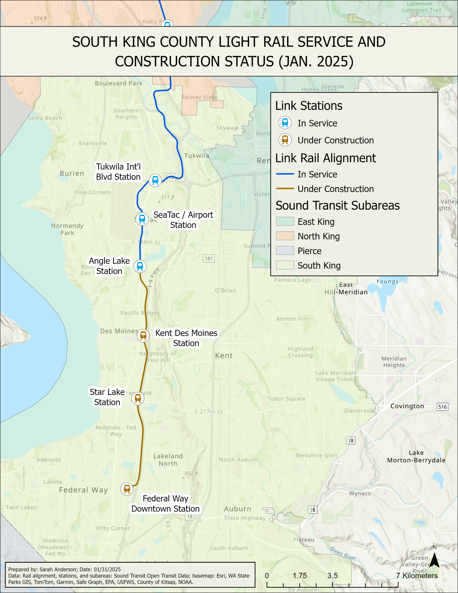

# South King Link Light Rail Corridor Map

A historical ArcGIS Pro map of Link light rail stations and rail-segment status from Tukwila International Boulevard Station to Federal Way Downtown Station, using data dated **January 31, 2025**.

## Workflow

1. **Select and filter the source layers.** I used the Sound Transit Open Transit Data layers for Link rail alignments, stations, and subarea boundaries, then focused the extent on the South King corridor.
2. **Encode mapped status.** Blue represents features mapped as **In Service** and amber represents features mapped as **Under Construction**. Matching station and line colors make the status comparison legible.
3. **Add map context.** Station labels, a legend, scale bar, north arrow, translucent subarea context, and source credits make the exported map readable on its own.

## Output

- `map.jpg` — exported final map.

## Visualization

*Historical corridor map showing station and rail-segment status as of January 31, 2025.*

## What the snapshot shows

Angle Lake and the stations to its north on the depicted line were shown as in service. Kent Des Moines, Star Lake, and Federal Way Downtown, along with the southern rail segment, were shown as under construction. The map communicates location and mapped status; it does not measure construction completion, predict opening dates, or evaluate ridership or project performance.

## Limitations

This is a historical map, not a Sound Transit publication or current service guide. Verify current Sound Transit information before using it for travel or project decisions. The selected corridor simplifies the regional network, and subarea boundaries provide context rather than a measure of service coverage. Station names and labels should be checked against the original dataset records if an authoritative historical record is required.

## Attribution

Tool: ArcGIS Pro. Transit source: Sound Transit Open Transit Data portal, including `LINKLine`, `LINKStations`, and `STSubareas` layers. Basemap and map credits are shown on the exported layout. Check the current portal terms and dataset metadata before reuse.

Author: Sarah Anderson.
